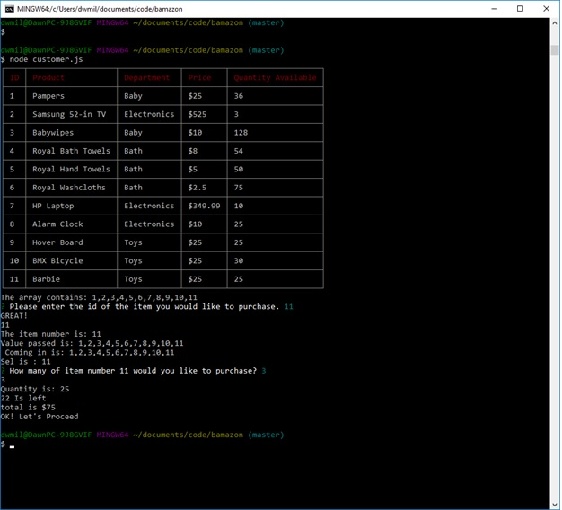
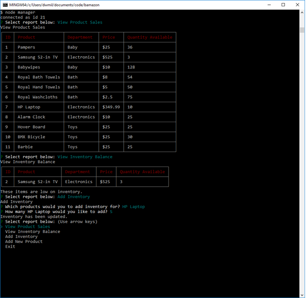

# Bamazon

A storefront app using MySQL, the MySQL NPM Package, and the Prompt Package. This app will take in orders from customers and deplete from the store's total stock. Use node bamazon.js to initialize the storefront. You will be prompted to enter the item you'd like to purchase and how many.

## Customer View

## Manager View

## Stack Used
* Node Packages
	* Inquirer
	* Table-Master
	* Clear

* MySQL Database

